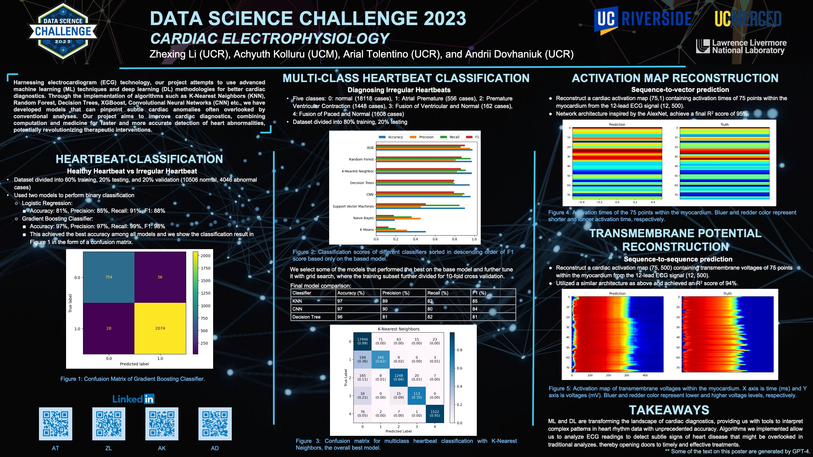

# Achyuth Kolluru

## Contact Information
- **Email:** achyuthkolluru2@gmail.com
- **GitHub:** [[Github]](https://github.com/AchyuthKolluru)
- **LinkedIn:** [[Linkedin]](https://www.linkedin.com/in/achyuth-kolluru)

## About
A current Masters student in the Masters of Information and Data Science Program at UC Berkeley, with a strong academic background from the University of California, Merced, holding a major in Computer Science and a minor in Applied Mathematics. Fascination with vision-based systems in computer science led to internships at Lawrence Livermore National Laboratory and Morning Star, working on advanced projects involving ECG data analysis and computer vision. A deep interest in machine learning, particularly in its applications in biology and cognitive science, continues to drive academic pursuits, alongside a dedication to advocating for individual privacy in AI advancements, ensuring that technological innovation aligns with ethical considerations.

## Education
- **University of California, Berkeley**  
  *Master of Information and Data Science*
  
- **University of California, Merced**  
  *Bachelor of Science, Major in Computer Science, Minor in Applied Mathematics*  
  - **Top Finisher** for Innovate to Grow Event for 2022 Fall Software Engineering Capstone  
  - **3rd Place Winner** for the Water Hack Challenge 2023 Issued by Secure Water Future

**Selected Coursework:**  
Applied Machine Learning, Computer Vision, Modern Applied Statistics, Fundamentals of Data Engineering, Statistical Methods of Time Series Data

## Programming Skills
- **Languages:** Python, C++, MATLAB, R, C, SQL
- **Technologies:** TensorFlow, Pytorch, Scikit Learn, Keras, Git, ROS, Linux, Jupyter, Pandas, PostgreSQL, Redis

## Experience

### Data Science Intern | Lawrence Livermore National Laboratory | June 2023 - July 2023
Engaged in a comprehensive ECG data analysis initiative at Lawrence Livermore National Laboratory, focusing on heartbeat classification, activation map reconstruction, and trans-membrane potential interpretation using advanced machine learning techniques. A convolutional neural network, inspired by the AlexNet architecture, was developed, achieving a 94% test accuracy in reconstructing 75 trans-membrane voltage signals over a 500-millisecond span. This work significantly advanced the understanding of complex ECG data and contributed to the development of more accurate predictive models.

**Project Presentation:**  

### Research Assistant | University of California Merced | November 2022 - May 2023
As a research assistant in advanced video processing, a cubic interpolation method was developed, enhancing video frame rates by incorporating the derivative of acceleration (Jerk) with deep learning techniques. The project also applied optical flow estimation techniques, such as PWC-Net, to improve the Peak Signal-to-Noise Ratio (PSNR) of interpolated images. The implementation of these techniques using PyTorch and CUDA resulted in a 20% improvement in PSNR compared to previous methods.

### Software Engineer Intern | Morning Star | August 2022 - December 2022
During the Software Engineer Internship at Morning Star, a computer vision project was spearheaded to employ Yolov4 Tiny and DeepSort for real-time detection, tracking, and counting of tomatoes during harvesting. Rigorous data extraction and meticulous labeling of a 3,000-image dataset facilitated efficient model training. A notification system was also developed to alert operators when tomato counts surpassed set thresholds, promoting operational efficiency and resource conservation. The project achieved a 78% accuracy rate under varying farming conditions and was recognized as the Top Finisher at the Innovate to Grow Event.

**Project Poster:**  

**Project Demonstration:**  

  

## Relevant Projects

### Delivery Simulation
A package delivery simulator was developed at UC Berkeley, integrating SQL, MongoDB, and Redis for dynamic real-time feedback. Neo4J was utilized for route optimization and live truck tracking, significantly enhancing logistics efficiency through real-time updates and optimized routing.

### Predicting Stream Flow
A convolutional neural network was designed to analyze ECG data and discern mental state shifts during diverse activities, achieving a 79% accuracy rate.

### Image Classification with Transfer Learning
Transfer learning techniques were implemented using pre-trained models such as VGG16 and ResNet50 to classify images from the CIFAR-10 dataset, achieving an accuracy of 85%.

### Time Series Forecasting and Statistical Analysis of CO2 Emissions Trends
Time series forecasting models, including ARIMA and SARIMA, were developed to analyze trends and seasonal patterns in CO2 emissions data. Extensive statistical analysis, including residual diagnostics and model validation, was conducted to ensure robust predictions. Anomalies in the data were identified and corrected, enhancing the accuracy and reliability of the forecasting models.

## Awards and Recognition
- **Top Finisher** for Innovate to Grow Event for 2022 Fall Software Engineering Capstone
- **3rd Place Winner** for the Water Hack Challenge 2023 Issued by Secure Water Future

