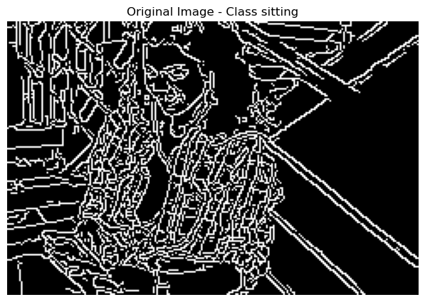

# Achyuth Kolluru

## Contact Information
- **Email:** achyuthkolluru2@gmail.com
- **GitHub:** [Github](https://github.com/AchyuthKolluru)
- **LinkedIn:** [Linkedin](https://www.linkedin.com/in/achyuth-kolluru)

## About
A current Master's student in the Masters of Information and Data Science Program at UC Berkeley, with a strong academic background from the University of California, Merced, holding a major in Computer Science and a minor in Applied Mathematics. Fascination with vision-based systems in computer science led to internships at Lawrence Livermore National Laboratory and Morning Star, working on advanced projects involving ECG data analysis and computer vision. A deep interest in machine learning, particularly in its applications in biology and cognitive science, continues to drive academic pursuits, alongside a dedication to advocating for individual privacy in AI advancements, ensuring that technological innovation aligns with ethical considerations.

## Education
- **University of California, Berkeley** (January 2024 - May 2025)  
  *Master of Information and Data Science*

- **University of California, Merced** (August 2019 - May 2023)  
  *Bachelor of Science, Major in Computer Science, Minor in Applied Mathematics*  
  - **Top Finisher** for Innovate to Grow Event for 2022 Fall Software Engineering Capstone  
  - **3rd Place Winner** for the Water Hack Challenge 2023 Issued by Secure Water Future

**Selected Coursework:**  
Applied Machine Learning | Computer Vision | Modern Applied Statistics | Fundamentals of Data Engineering | Statistical Methods of Time Series Data | Machine Learning at Scale

 

## Programming Skills
- **Languages:** Python, C++, MATLAB, R, C, SQL
- **Technologies:** TensorFlow, Pytorch, Scikit Learn, Keras, Git, ROS, Linux, Jupyter, Pandas, PostgreSQL, Redis

## Experience

### Data Science Intern | Lawrence Livermore National Laboratory | June 2023 - July 2023
Conducted ECG data analysis, focusing on heartbeat classification, activation map reconstruction, and trans-membrane potential interpretation. Developed a convolutional neural network, based on AlexNet, that achieved 94% test accuracy in reconstructing 75 trans-membrane voltage signals over 500 milliseconds, enhancing the accuracy of predictive models.

**Project Presentation:**  

### Research Assistant | University of California Merced | November 2022 - May 2023
Developed a cubic interpolation method for video frame rate enhancement by incorporating the derivative of acceleration (Jerk) with deep learning. Applied optical flow estimation techniques, including PWC-Net, to improve the Peak Signal-to-Noise Ratio (PSNR) of interpolated images by 20% using PyTorch and CUDA.

### Software Engineer Intern | Morning Star | August 2022 - December 2022
Led a computer vision project using Yolov4 Tiny and DeepSort for real-time detection, tracking, and counting of tomatoes during harvesting. Managed data extraction and labeling for a 3,000-image dataset, which facilitated efficient model training. Developed a notification system to alert operators when tomato counts exceeded thresholds. The project achieved 78% accuracy and was recognized as the Top Finisher at the Innovate to Grow Event.

**Project Poster:**  

**Project Demonstration:**  

  

 
 

## Relevant Projects

### Brooke AI Broker (Capstone Project)
**Description:** Brooke is an AI‑powered real estate assistant that provides end‑to‑end homebuying guidance. Built with Python, Gradio, LangChain (Chroma + HuggingFaceEmbeddings), and Folium, it features a specialized chatbot that answers location‑specific questions, an interactive budget calculator that simulates financial scenarios, and a dynamic market trends dashboard with Altair charts and comparative maps. Users receive personalized, data‑driven insights—such as median sale price forecasts and inventory levels—tailored to their selected metro areas and neighborhoods, all without the cost of a traditional broker.

More iformation and Demo can be viewed at iSchool Berkeley.

**Demo & Details:** [View on iSchool Berkeley](https://www.ischool.berkeley.edu/projects/2025/brooke-ai-broker)

### Hybrid Sentiment-Driven Stock Forecasting

**GitHub Repository:**  
[https://github.com/AchyuthKoll/w266_Project](https://github.com/AchyuthKoll/w266_Project)

**Project Report (PDF):**  
[Read the Full Paper](assets/Twitter_Sentiment_Report.pdf)

**Description:**  
This project explores a hybrid forecasting system that integrates transformer-based sentiment analysis with historical market data to predict next-day stock returns. Using over **68,000 financial tweets** labeled with bullish/neutral/bearish sentiment and **10 years of Yahoo Finance data**, two transformer models—**BERT** and **FinBERT**—were fine-tuned and analyzed with varying pooling strategies (CLS, mean, max).

Daily sentiment embeddings were generated and aggregated by ticker, then merged with financial indicators such as returns and volatility. These features were fed into Dense and LSTM-based neural networks under different configurations: **price-only**, **sentiment-only**, and **combined**. Hyperparameter tuning was performed using **Optuna**, and final models were evaluated using **Mean Absolute Error (MAE)** and **directional accuracy**.

**Highlights:**
- Achieved **71% validation accuracy** in tweet sentiment classification.
- LSTM with mean-pooled FinBERT embeddings reached **56.8% directional accuracy**, outperforming the naive baseline.
- Dense network with CLS embeddings yielded the lowest MAE and robust predictive performance.

**Skills & Tools:**  
PyTorch, HuggingFace Transformers, TensorFlow, Optuna, LSTM, Time Series Forecasting, Financial NLP, Data Aggregation, Visualization

---

### Flight Delay Prediction and Analysis
**Description:**  
Developed a machine learning-based system for predicting flight delays using a large-scale historical flight dataset (approximately 30GB). The project involved extensive **data preprocessing**, including handling missing values, encoding categorical variables, and feature engineering to enhance model performance. Various machine learning models, including **Random Forest**, **XGBoost**, and **Linear Regression**, were applied to predict flight delays. 

Model performance was evaluated using metrics such as **accuracy**, **precision**, **recall**, and **F1 score** to assess the effectiveness of each algorithm. To efficiently process the large dataset, **PySpark ML** was leveraged for **parallelized data processing** and **model training**. This approach utilized only **CPU parallelization**, ensuring scalable and high-performance execution even with the large 30GB dataset. The system demonstrated the ability to scale efficiently with large data and deliver real-time predictive capabilities for flight delay analysis.

The project showcases expertise in **predictive modeling**, **feature engineering**, and **distributed computing** with a focus on time-sensitive predictions, making it well-suited for real-world flight delay forecasting and optimization.

**GitHub Repository:**  
[https://github.com/AchyuthKolluru/Flight-Delay-Prediction-and-Analysis]

### Delivery Simulation
A package delivery simulation system was created, integrating SQL, MongoDB, and Redis to provide dynamic, real-time feedback throughout the delivery process. Neo4J was employed for advanced route optimization and live tracking of delivery trucks. This solution enhanced logistics efficiency by providing real-time updates and optimized routing, leading to quicker deliveries and more effective resource allocation.

*Project Demonstration:*  

  

 

### Analyzing Airbnb Listings in NYC (2019)
Conducted a thorough analysis of NYC Airbnb 2019 data, focusing on feature engineering to extract meaningful insights and enhance model performance. Multiple predictive models, including linear regression, decision trees, and ensemble methods, were developed and rigorously compared for pricing accuracy. By evaluating key metrics such as RMSE and MAE, the best-performing model was selected to optimize rental price predictions.

### Model Error Analysis

  

    <h4>Error Metrics</h4>
    
  

  

    <h4>Model Performance Comparison</h4>
    
  

 

### Image Classification with Transfer Learning
Transfer learning techniques were implemented using pre-trained models such as VGG16 and ResNet50 to classify images from the CIFAR-10 dataset, achieving an accuracy of 85%.

 

### Time Series Forecasting and Statistical Analysis of CO2 Emissions Trends
Time series forecasting models, including ARIMA and SARIMA, were developed to analyze trends and seasonal patterns in CO2 emissions data. Extensive statistical analysis, including residual diagnostics and model validation, was conducted to ensure robust predictions. Anomalies in the data were identified and corrected, enhancing the accuracy and reliability of the forecasting models.

The data spans from 1958 to 1997, using ARIMA to predict both near-term (2022) and long-term (2100) CO2 levels. The upper, expected, and lower bounds indicate when CO2 concentrations are likely to cross critical thresholds of 420 ppm and 500 ppm. These projections help in understanding potential future CO2 trends under various scenarios, providing valuable insights into long-term environmental planning and policy-making.

| Model      | sigma^2   | log_lik  | AIC      | AICc     | BIC      |
|------------|-----------|----------|----------|----------|----------|
| arima_full | 0.0860309 | -85.59152| 181.1830 | 181.3167 | 201.7845 |
| arima_test | 0.0857657 | -85.91671| 181.8334 | 181.9668 | 202.4459 |

# Human Action Recognition (HAR) using Computer Vision

## Overview
This project involved developing a Human Action Recognition system to classify human activities in images using machine learning and computer vision techniques. The dataset contained 15 different human activities, with a total of 12,600 training images and 5,410 test images. Several image processing techniques were applied to extract meaningful features for classification.

## Feature Extraction Techniques
Below are the key image processing techniques used for feature extraction:

### 1. Original Image
The dataset images were standardized to 256x256 pixels. Below is an example of an original image:

### 2. Grayscale Conversion
Converted the images to grayscale to simplify the information while retaining essential details for classification.

### 3. Edge Detection (Canny)
Used the Canny edge detection algorithm to highlight the important structural features of the image.

### 4. Histogram of Oriented Gradients (HOG)
Applied HOG to capture gradient-based features that describe the shapes and contours of the image, which are crucial for action recognition.

### 5. Local Binary Patterns (LBP)
Extracted texture-based features using LBP, which helps capture fine-grained patterns critical for recognizing different human actions.

### 6. Template Matching
Template matching was applied to detect predefined patterns of human actions in the images.

## Model Evaluation

After preprocessing and feature extraction, several machine learning models were trained to classify the actions.

### Models Used:
- **Logistic Regression**
- **Random Forest**
- **XGBoost**
- **Custom Convolutional Neural Network (CNN)**
- **Transfer Learning with VGG16**

### Performance Evaluation

The model was evaluated using the following metrics:
- **Accuracy**
- **Precision**
- **Recall**
- **F1-score**

### 1. Confusion Matrix
The confusion matrix of the best-performing model, based on the preprocessed features, is shown below:

### 2. ROC Curve
The ROC curve for the model illustrates its performance in distinguishing between different classes.

---

## Conclusion
This project successfully applied a combination of computer vision techniques for feature extraction and machine learning models for action recognition. The model was evaluated using confusion matrices and ROC curves to assess its performance. Future work may involve fine-tuning the model with more advanced techniques, such as deep learning.

---

## GitHub Repository
[Link to GitHub repository](https://github.com/username/har_project)

## Awards and Recognition
- **Top Finisher** for Innovate to Grow Event for 2022 Fall Software Engineering Capstone
- **3rd Place Winner** for the Water Hack Challenge 2023 Issued by Secure Water Future
